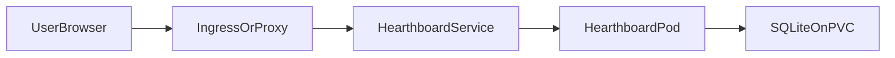

# Deployment Guide

Hearthboard ships as a single-container application backed by SQLite. Docker Compose is the simplest deployment path; Kubernetes is supported through Kustomize overlays.

## Architecture



- One replica only. SQLite requires a single writer and a persistent volume.
- Liveness probe: `GET /api/health`
- Readiness probe: `GET /api/ready` (verifies SQLite is reachable)
- Data directory: `/data/hearthboard.db`

## Docker Compose

### Production pull

After the GHCR image is published, set `HEARTHBOARD_IMAGE` in `.env` and pull:

```bash
cp .env.example .env
# Set HEARTHBOARD_IMAGE=ghcr.io/j4v3l/hearthboard:latest in .env
docker compose pull
docker compose up -d
```

Open `http://localhost:3000` (or the port set in `.env`).

### Local build (default)

```bash
cp .env.example .env
docker compose up -d --build
```

Open `http://localhost:3000` (or the port set in `.env`).

### ICMP Ping checks

Ping checks require raw network capability. Enable it only when needed:

```bash
docker compose -f docker-compose.yml -f docker-compose.icmp.yml up -d --build
```

HTTP and TCP checks work without `NET_RAW`.

### Environment variables

See [`.env.example`](../.env.example) and the README configuration table.

Notable defaults in Compose:

- `ALLOW_INSECURE_TLS=false` for stricter HTTPS validation
- `stop_grace_period: 30s` for graceful shutdown
- Compose health check uses `/api/ready`

### Backup and restore

- Preferred: `Manage -> Export CSV` in the UI
- Full state: back up the Docker volume `hearthboard-data` or the SQLite file at `/data/hearthboard.db`

### Upgrade

```bash
docker compose pull
docker compose up -d
```

The SQLite file is preserved in the named volume across upgrades.

## Kubernetes

Manifests live under [`deploy/kubernetes`](../deploy/kubernetes).

### Default deployment

```bash
kubectl apply -k deploy/kubernetes/overlays/default
kubectl -n hearthboard rollout status deployment/hearthboard
kubectl -n hearthboard port-forward svc/hearthboard 3000:80
```

### ICMP Ping checks

```bash
kubectl apply -k deploy/kubernetes/overlays/icmp
```

This overlay adds `NET_RAW` to the container security context.

### Customize image or storage

Edit the overlay or patch the base `images` block in [`deploy/kubernetes/base/kustomization.yaml`](../deploy/kubernetes/base/kustomization.yaml):

```yaml
images:
  - name: ghcr.io/j4v3l/hearthboard
    newName: ghcr.io/your-org/hearthboard
    newTag: v1.0.0
```

To set a storage class, patch the PVC in an overlay:

```yaml
apiVersion: v1
kind: PersistentVolumeClaim
metadata:
  name: hearthboard-data
spec:
  storageClassName: your-storage-class
```

### Ingress

The base manifest exposes a `ClusterIP` service on port 80. Add your own Ingress resource in an overlay or cluster ingress controller. The app expects to run at the root of a hostname (for example `https://dashboard.example.test/`).

Example annotations depend on your ingress controller. A minimal pattern:

```yaml
apiVersion: networking.k8s.io/v1
kind: Ingress
metadata:
  name: hearthboard
spec:
  rules:
    - host: dashboard.example.test
      http:
        paths:
          - path: /
            pathType: Prefix
            backend:
              service:
                name: hearthboard
                port:
                  number: 80
```

### Probes

| Probe | Path | Purpose |
| --- | --- | --- |
| Startup | `/api/ready` | Wait for SQLite initialization |
| Readiness | `/api/ready` | Remove pod from service endpoints when DB is unavailable |
| Liveness | `/api/health` | Restart unhealthy containers |

### Security notes

- No built-in authentication. Place behind a trusted network or external auth layer.
- `ALLOW_INSECURE_TLS=false` is the secure default in Compose and Kubernetes manifests.
- Grant `NET_RAW` only when Ping checks are required.
- Health checks can make outbound requests to targets configured in the dashboard.

## Validation

Local checks used before release:

```bash
npm ci
npm run build
docker compose -f docker-compose.yml config
bash scripts/docker-smoke-test.sh
bash scripts/validate-kubernetes.sh default
bash scripts/validate-kubernetes.sh icmp
```

CI runs the same build, Compose, Docker smoke, and Kubernetes validation steps on pull requests and branch pushes.
